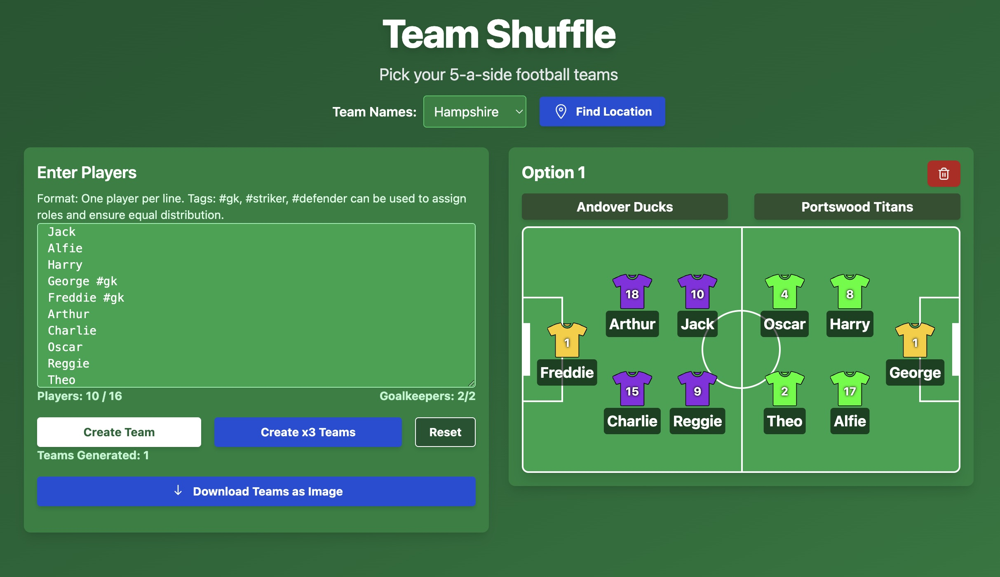

# TeamShuffle

A React web app built to simplify picking 5-a-side football teams. The app ensures balanced teams by considering player roles and provides fun, shareable outputs.



### Features

- Randomly allocate players to two teams
- Players can be tagged as goalkeepers, defenders, or strikers to ensure balanced teams
- Generate multiple team options for voting
- Randomly generated team names, with local options for London and Hampshire (more regions can be added)
- Export saved teams as an image to share with friends

### Local Development

Get started hacking on **TeamShuffle** in just a few steps:

1. Install dependencies
   ```bash
   npm install
   ```
2. Launch the hot-reloading dev server and visit `http://localhost:5173`
   ```bash
   npm run dev
   ```
3. Create and preview a production build
   ```bash
   npm run build
   npm run preview
   ```

#### Linting

Keep your code tidy with:

```bash
npm run lint
```

### Deployment

The app is available at [TeamShuffle](https://teamshuffle.app).

### Contributing

Contributions are welcome! Feel free to fork the repository and submit a pull request.

### License

This project is licensed under the MIT License. See the LICENSE file for details.


